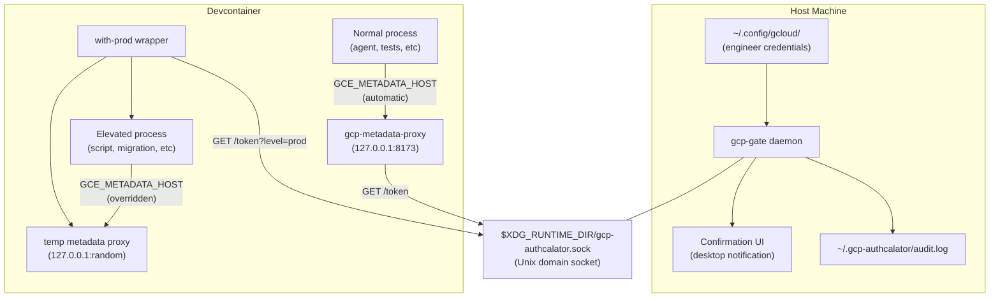

# Devcontainer Credential Isolation

gcp-authcalator is an auth escalator for GCP in development environments.

## Problem

Running an AI coding agent inside the same devcontainer as the engineer is convenient and encouraged by modern IDEs — but it creates a serious credential exposure problem. GCP credentials in the devcontainer are **global**: `google.auth.default()` returns the engineer's full-privilege credentials to any process. An unattended coding agent, a compromised dependency, or a prompt-injected tool has the same access as the engineer, including production database write access and SOPS secret decryption. There is no privilege boundary between the engineer's interactive session and automated tooling.

gcp-authcalator keeps credentials on the host and requires human approval for all privilege escalation. Processes running as other OS users cannot access the token socket (ideally, coding agents should run as a separate user). For same-user processes, defense-in-depth measures (PID-based restriction, environment isolation, rate limiting) make credential abuse significantly harder.

## Architecture



**Key security property:** Credentials never enter Docker. The Unix socket is the only channel, and the host daemon controls what tokens are issued.
The container only gets downscoped credentials that are only valid for a certain TTL, not the user's root credentials (which would be dangerous if intercepted or exfiltrated).

## Design Decisions

### 1. Why a GCE metadata server emulator (not credential files)?

All Google Cloud client libraries -- Python `google-auth`, `gcloud` CLI, Node `google-auth-library` -- follow the same credential chain. The last step is the GCE metadata server. By setting `GCE_METADATA_HOST=127.0.0.1:8173`, all libraries transparently fetch tokens from our controlled proxy. **Zero application code changes needed.** This is the same mechanism GKE workloads already use.

### 2. Why a Unix domain socket (not bridge network/source port)?

The user's initial idea of tying privileges to a source port on a bridge network has issues:

- Source ports are **ephemeral** and not deterministically tied to processes
- A process inside the container could bind a specific port to impersonate an elevated process
- Docker bridge networks don't offer source-port-based access control

A Unix domain socket is a secure, private IPC channel. The host daemon controls it, and the container can only send requests through it -- it cannot access the credentials backing the daemon.

The end user will need to mount it into the devcontainer.

### 3. Why `generateAccessToken` (not Workload Identity Federation)?

GCP's IAM `generateAccessToken` API creates short-lived access tokens for a service account. The host daemon uses the engineer's credentials + `serviceAccountTokenCreator` role on the target service account to mint tokens. This avoids the complexity of setting up a WIF pool + custom OIDC issuer, while producing the same result: scoped, short-lived tokens.

WIF is a natural "Phase 2" enhancement if stronger audit trails or attribute conditions are needed.

### 4. Why per-process metadata proxy for elevation (not just env vars)?

`CLOUDSDK_AUTH_ACCESS_TOKEN` works for gcloud CLI, but Python `google-auth` and other libraries don't honor it. They need either a credential file or a metadata server. For `with-prod`, we spin up a **temporary metadata proxy on a random port** that serves the elevated token, and set `GCE_METADATA_HOST` for just that process tree. This makes elevation transparent to all libraries.

## Components

All components are sub-commands of a single `gcp-authcalator` binary, distributed as a compiled Bun executable.
Configuration (project ID, service account, socket path, port) can be provided via CLI flags or a TOML config file (CLI takes precedence).

### 1. GCP IAM Setup (prerequisites)

- Create a service account with limited permissions for development use.
- Grant developers the `roles/iam.serviceAccountTokenCreator` role on that service account.

### 2. `gcp-gate` -- Host-Side Token Daemon

A small HTTP server using the `google-auth-library` library. Runs on the host machine.

**API (over Unix socket):**

| Endpoint                | Behavior                                                                 |
| ----------------------- | ------------------------------------------------------------------------ |
| `GET /token`            | Impersonates the default SA, returns access token immediately            |
| `GET /token?level=prod` | Shows host-side confirmation, then returns token for engineer's identity |
| `GET /identity`         | Returns the authenticated user's email                                   |
| `GET /project-number`   | Returns the numeric project ID (resolved via Cloud Resource Manager API) |
| `GET /universe-domain`  | Returns the GCP universe domain (resolved via GoogleAuth)                |
| `GET /health`           | Health check                                                             |

**Token generation** uses `[iamcredentials.generateAccessToken](https://cloud.google.com/iam/docs/reference/credentials/rest/v1/projects.serviceAccounts/generateAccessToken)` for dev tokens (1-hour TTL). For prod tokens, it uses the engineer's own ADC (which stays on the host).

**Confirmation flow** for prod tokens:

1. Desktop dialog via `zenity` (Linux) or `osascript` (macOS) with approve/deny (60-second timeout)
2. Fallback: terminal prompt on the host (if TTY is available)
3. Deny by default if no interactive method is available

**Rate limiting:** Single-flight lock (one dialog at a time), 5-second cooldown after denial, maximum 5 attempts per minute. This prevents automated brute-forcing of the confirmation flow.

**Socket security:** The Unix socket is created with `0600` permissions in a `0700` directory (`$XDG_RUNTIME_DIR` or `~/.gcp-authcalator/`). Stale sockets are cleaned up only after verifying ownership, refusing to follow symlinks, and checking that no other instance is running.

**Lifecycle:** Started by the devcontainer initialize script (runs on host before container build). Stopped when container is destroyed. Could later be a systemd/launchd user service for persistence.

### 3. `gcp-metadata-proxy` -- Container-Side Metadata Emulator

A minimal HTTP server implementing the GCE metadata server protocol (using data from the gcp-gate):

```
GET /computeMetadata/v1/instance/service-accounts/default/token
  → {"access_token": "ya29...", "expires_in": 3600, "token_type": "Bearer"}

GET /computeMetadata/v1/project/project-id
  → project id

GET /computeMetadata/v1/project/numeric-project-id
  → numeric project id (resolved via Cloud Resource Manager API)

GET /computeMetadata/v1/instance/service-accounts/
  → directory listing of available service accounts (returns "default")

GET /computeMetadata/v1/universe/universe_domain
  → universe domain (e.g. "googleapis.com", resolved via gcp-gate)

GET /  (metadata server detection ping)
  → 200 OK with Metadata-Flavor: Google header
```

Validates the `Metadata-Flavor: Google` request header (standard metadata server security). Fetches dev-scoped tokens from `gcp-gate` via the socket, caches until 5 minutes before expiry.

**Started by** the devcontainer post start script as a background process.

### 4. `with-prod` -- Elevation Wrapper

The conceptual flow (simplified pseudocode):

```bash
#!/bin/bash
set -euo pipefail

# 1. Request prod token from host daemon (triggers confirmation dialog)
RESPONSE=$(curl -sf --unix-socket "$XDG_RUNTIME_DIR/gcp-authcalator.sock" \
  http://gate/token?level=prod)

# 2. Start temporary metadata proxy serving this specific token
#    (on a random port, restricted to the child process tree via PID validation)

# 3. Create an isolated gcloud config directory with the token written to a file
#    (not an env var — avoids /proc/*/environ exposure)

# 4. Strip credential env vars and spawn the command with GCE_METADATA_HOST
#    pointing at the temporary proxy

# 5. Forward signals, propagate exit code, clean up temp files
```

The actual implementation adds several security hardening measures beyond this pseudocode:

- **PID-based process restriction** — the temporary proxy validates that each requesting process is a descendant of the `with-prod` wrapper (via `/proc` introspection)
- **Token file instead of env var** — the access token is written to a `0600` file in a user-private directory, and gcloud is configured via `auth/access_token_file` rather than `CLOUDSDK_AUTH_ACCESS_TOKEN` (which leaks into `/proc/*/environ`)
- **Environment stripping** — all credential-related env vars (`GOOGLE_APPLICATION_CREDENTIALS`, `CLOUDSDK_AUTH_ACCESS_TOKEN`, `CLOUDSDK_AUTH_CREDENTIAL_FILE_OVERRIDE`, etc.) are removed from the child's environment to prevent bypass
- **Temp directory in user-private runtime dir** — not `/tmp`, preventing other users from observing or racing the temp directory

Usage: `with-prod -- python some/script.py`, `with-prod -- gcloud sql instances list`, `with-prod -- alembic upgrade head`
