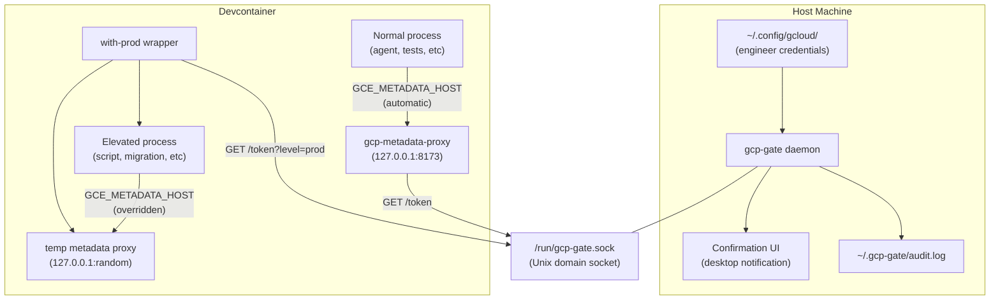

# Devcontainer Credential Isolation

gcp-authcalator is an auth escalator for GCP in development environments.

## Problem

GCP credentials in the devcontainer are **global** `google.auth.default()` returns the engineer's full-privilege credentials to any process. An unattended coding agent has the same access as the engineer, including production database write access and SOPS secret decryption.

## Architecture



**Key security property:** Credentials never enter Docker. The Unix socket is the only channel, and the host daemon controls what tokens are issued.
The container only gets downscoped credentials that are only valid for a certain TTL, not the user's root credentials (which would be dangerous if intercepted or exfiltrated).

## Design Decisions

### 1. Why a GCE metadata server emulator (not credential files)?

All Google Cloud client libraries -- Python `google-auth`, `gcloud` CLI, Node `google-auth-library` -- follow the same credential chain. The last step is the GCE metadata server. By setting `GCE_METADATA_HOST=127.0.0.1:8173`, all libraries transparently fetch tokens from our controlled proxy. **Zero application code changes needed.** This is the same mechanism GKE workloads already use.

### 2. Why a Unix domain socket (not bridge network/source port)?

The user's initial idea of tying privileges to a source port on a bridge network has issues:

- Source ports are **ephemeral** and not deterministically tied to processes
- A process inside the container could bind a specific port to impersonate an elevated process
- Docker bridge networks don't offer source-port-based access control

A Unix domain socket is a secure, private IPC channel. The host daemon controls it, and the container can only send requests through it -- it cannot access the credentials backing the daemon.

The end user will need to mount it into the devcontainer.

### 3. Why `generateAccessToken` (not Workload Identity Federation)?

GCP's IAM `generateAccessToken` API creates short-lived access tokens for a service account. The host daemon uses the engineer's credentials + `serviceAccountTokenCreator` role (already granted to the engineering group on `dev-test-runner` per [dev.ts](backend/deploy/pulumi/dev.ts)) to mint tokens. This avoids the complexity of setting up a WIF pool + custom OIDC issuer, while producing the same result: scoped, short-lived tokens.

WIF is a natural "Phase 2" enhancement if stronger audit trails or attribute conditions are needed.

### 4. Why per-process metadata proxy for elevation (not just env vars)?

`CLOUDSDK_AUTH_ACCESS_TOKEN` works for gcloud CLI, but Python `google-auth` and other libraries don't honor it. They need either a credential file or a metadata server. For `with-prod`, we spin up a **temporary metadata proxy on a random port** that serves the elevated token, and set `GCE_METADATA_HOST` for just that process tree. This makes elevation transparent to all libraries.

## Components

The following components (except for the prerequisites) can be implemented as sub-commands of `gcp-authcalator`.
We'll distribute this as one single-file executable using `bun` to make deployment easy.
Arguments for the necessary GCP configuration (like the project id, and which service account to impersonate for the default downscoped credentials, or what role/service account to escalate to via PAM for elevated credentials) should be configurable.
The configuration options will be widely shared for consistency.
Accept them as CLI, or from a minimal toml file (the CLI takes precedence over the config file).
Follow modern patterns for these settings, and ensure that all values are validated accordingly.

### 1. GCP IAM Setup (prerequisites)

- Create a Service Account with limited permissions that can be used for development.
- Ensure developers have access as `serviceAccountTokenCreator`.
- Optional: Create a GCP PAM entitlement for prod-level access with approval requirements

### 2. `gcp-gate` -- Host-Side Token Daemon

A small HTTP server using the `google-auth-library` library. Runs on the host machine.

**API (over Unix socket):**

| Endpoint                | Behavior                                                                 |
| ----------------------- | ------------------------------------------------------------------------ |
| `GET /token`            | Impersonates the default SA, returns access token immediately            |
| `GET /token?level=prod` | Shows host-side confirmation, then returns token for engineer's identity |
| `GET /identity`         | Returns the authenticated user's email                                   |
| `GET /project-number`   | Returns the numeric project ID (resolved via Cloud Resource Manager API) |
| `GET /universe-domain`  | Returns the GCP universe domain (resolved via GoogleAuth)                |
| `GET /health`           | Health check                                                             |

**Token generation** uses `[iamcredentials.generateAccessToken](https://cloud.google.com/iam/docs/reference/credentials/rest/v1/projects.serviceAccounts/generateAccessToken)` for dev tokens (1-hour TTL). For prod tokens, it uses the engineer's own ADC (which stays on the host).

**Confirmation flow** for prod tokens:

1. Desktop notification via `notify-send` (Linux) with approve/deny
2. Fallback: terminal prompt on the host
3. Future enhancement: TOTP challenge with configurable TTL (e.g., one confirmation per 30 minutes)

**Lifecycle:** Started by the devcontainer initialize script (runs on host before container build). Stopped when container is destroyed. Could later be a systemd/launchd user service for persistence.

### 3. `gcp-metadata-proxy` -- Container-Side Metadata Emulator

A minimal HTTP server implementing the GCE metadata server protocol (using data from the gcp-gate):

```
GET /computeMetadata/v1/instance/service-accounts/default/token
  → {"access_token": "ya29...", "expires_in": 3600, "token_type": "Bearer"}

GET /computeMetadata/v1/project/project-id
  → project id

GET /computeMetadata/v1/project/numeric-project-id
  → numeric project id (resolved via Cloud Resource Manager API)

GET /computeMetadata/v1/instance/service-accounts/
  → directory listing of available service accounts (returns "default")

GET /computeMetadata/v1/universe/universe-domain
  → universe domain (e.g. "googleapis.com", resolved via gcp-gate)

GET /  (metadata server detection ping)
  → 200 OK with Metadata-Flavor: Google header
```

Validates the `Metadata-Flavor: Google` request header (standard metadata server security). Fetches dev-scoped tokens from `gcp-gate` via the socket, caches until 5 minutes before expiry.

**Started by** the devcontainer post start script as a background process.

### 4. `with-prod` -- Elevation Wrapper

Logic similar to this bash script to get an elevated token and configure a subprocess to use it.

```bash
#!/bin/bash
set -euo pipefail

# 1. Request prod token from host daemon (triggers confirmation)
RESPONSE=$(curl -sf --unix-socket /run/gcp-gate.sock http://gate/token?level=prod)
TOKEN=$(echo "$RESPONSE" | jq -r .access_token)
EXPIRY=$(echo "$RESPONSE" | jq -r .expires_in)

# 2. Start temporary metadata proxy serving this specific token
PORT=$(python3 -c 'import socket; s=socket.socket(); s.bind(("",0)); print(s.getsockname()[1]); s.close()')
gcp-metadata-proxy --port "$PORT" --static-token "$TOKEN" --expires-in "$EXPIRY" &
PROXY_PID=$!
trap "kill $PROXY_PID 2>/dev/null" EXIT

# 3. Override env vars for child process only
export GCE_METADATA_HOST="127.0.0.1:$PORT"
export CLOUDSDK_AUTH_ACCESS_TOKEN="$TOKEN"
export CPL_GS_BEARER="$TOKEN"  # For GDAL/rasterio GCS access

# 4. Exec the command
exec "$@"
```

Usage: `with-prod python some/script.py`, `with-prod gcloud sql instances list`, `with-prod alembic upgrade head`
