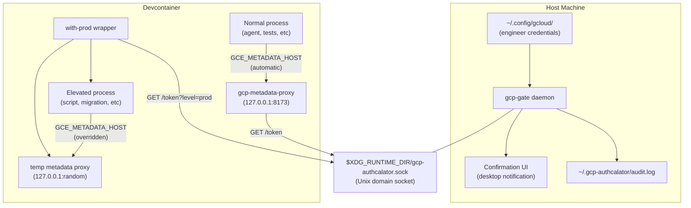

# Devcontainer Credential Isolation

gcp-authcalator is an auth escalator for GCP in development environments.

## Problem

Running an AI coding agent inside the same devcontainer as the engineer is convenient and encouraged by modern IDEs — but it creates a serious credential exposure problem. GCP credentials in the devcontainer are **global**: `google.auth.default()` returns the engineer's full-privilege credentials to any process. An unattended coding agent, a compromised dependency, or a prompt-injected tool has the same access as the engineer, including production database write access and SOPS secret decryption. There is no privilege boundary between the engineer's interactive session and automated tooling.

gcp-authcalator keeps credentials on the host and requires human approval for all privilege escalation. Processes running as other OS users cannot access the token socket (ideally, coding agents should run as a separate user). For same-user processes, defense-in-depth measures (PID-based restriction, environment isolation, rate limiting) make credential abuse significantly harder.

## Architecture


```mermaid
graph TB
  subgraph host [Host Machine]
    creds["~/.config/gcloud/\n(engineer credentials)"]
    gate["gcp-gate daemon\n"]
    confirm["Confirmation UI\n(desktop notification)"]
    audit["~/.gcp-authcalator/audit.log"]
    creds --> gate
    gate --> confirm
    gate --> audit
  end

  subgraph container [Devcontainer]
    proxy["gcp-metadata-proxy\n(127.0.0.1:8173)"]
    withprod["with-prod wrapper"]
    tmpproxy["temp metadata proxy\n(127.0.0.1:random)"]
    app["Normal process\n(agent, tests, etc)"]
    elevated["Elevated process\n(script, migration, etc)"]

    app -->|"GCE_METADATA_HOST\n(automatic)"| proxy
    elevated -->|"GCE_METADATA_HOST\n(overridden)"| tmpproxy
    withprod --> tmpproxy
    withprod --> elevated
  end

  socket["$XDG_RUNTIME_DIR/gcp-authcalator.sock\n(Unix domain socket)"]
  gate --- socket
  proxy -->|"GET /token"| socket
  withprod -->|"GET /token?level=prod"| socket
```

**Key security property:** Credentials never enter Docker. The Unix socket (local) or TCP+mTLS connection (remote) is the only channel, and the host daemon controls what tokens are issued.
The container only gets downscoped credentials that are only valid for a certain TTL, not the user's root credentials (which would be dangerous if intercepted or exfiltrated).

### Remote Architecture (TCP + mTLS)

For remote development environments (SSH devcontainers, GitHub Codespaces, Coder), the gate daemon also listens on a TCP port secured with mutual TLS. Unix sockets cannot cross network boundaries, so TCP+mTLS provides a secure transport for remote scenarios while preserving the core security property: credentials never leave the developer's machine.

```
Developer's Laptop                          Remote Host / Codespace / Coder
┌─────────────────────┐                     ┌──────────────────────────────┐
│  ADC credentials    │                     │  Devcontainer                │
│  gcp-gate daemon    │◄── mTLS over ───────│  gcp-metadata-proxy          │
│    TCP :8174        │    forwarded port    │    (127.0.0.1:8173)          │
│  Confirmation UI    │                     │  with-prod                   │
│  CA + server cert   │                     │  CA cert + client cert/key   │
└─────────────────────┘                     └──────────────────────────────┘
         │                                           │
    SSH port forward                          Port forwarding via:
    gh cs ports forward                        - SSH -R
    coder port-forward                         - VS Code
    VS Code port forward                       - gh CLI
                                               - Coder CLI
```

**Why mTLS (not bearer tokens)?**

- **Mutual authentication**: both sides verify identity (gate verifies client, client verifies gate)
- **No shared secret in transit**: TLS handshake, not a header token that could be logged
- **Certificate pinning**: the self-signed CA means no trust-store dependency
- **Replay resistance**: TLS session keys are ephemeral

**Certificate management:**

- Certificates are generated explicitly via `gcp-authcalator init-tls` (never auto-generated by gate)
- Gate loads and validates existing certs on startup; fails with a clear error if certs are missing or expired
- Server cert (SAN: localhost, 127.0.0.1) and client cert signed by the CA
- ECDSA P-256 algorithm (universally supported in WebCrypto)
- 90-day lifetime for all certificates (CA, server, and client)
- Client bundle (CA cert + client cert + client key) distributed as base64-encoded env var

**Local devcontainers remain unchanged** — Unix socket mode is the default and requires no TLS configuration.

## Design Decisions

### 1. Why a GCE metadata server emulator (not credential files)?

All Google Cloud client libraries -- Python `google-auth`, `gcloud` CLI, Node `google-auth-library` -- follow the same credential chain. The last step is the GCE metadata server. By setting `GCE_METADATA_HOST=127.0.0.1:8173`, all libraries transparently fetch tokens from our controlled proxy. **Zero application code changes needed.** This is the same mechanism GKE workloads already use.

### 2. Why a Unix domain socket (not bridge network/source port)?

The user's initial idea of tying privileges to a source port on a bridge network has issues:

- Source ports are **ephemeral** and not deterministically tied to processes
- A process inside the container could bind a specific port to impersonate an elevated process
- Docker bridge networks don't offer source-port-based access control

A Unix domain socket is a secure, private IPC channel. The host daemon controls it, and the container can only send requests through it -- it cannot access the credentials backing the daemon.

The end user will need to mount it into the devcontainer.

### 3. Why `generateAccessToken` (not Workload Identity Federation)?

GCP's IAM `generateAccessToken` API creates short-lived access tokens for a service account. The host daemon uses the engineer's credentials + `serviceAccountTokenCreator` role on the target service account to mint tokens. This avoids the complexity of setting up a WIF pool + custom OIDC issuer, while producing the same result: scoped, short-lived tokens.

WIF is a natural "Phase 2" enhancement if stronger audit trails or attribute conditions are needed.

### 4. Why per-process metadata proxy for elevation (not just env vars)?

`CLOUDSDK_AUTH_ACCESS_TOKEN` works for gcloud CLI, but Python `google-auth` and other libraries don't honor it. They need either a credential file or a metadata server. For `with-prod`, we spin up a **temporary metadata proxy on a random port** that serves the elevated token, and set `GCE_METADATA_HOST` for just that process tree. This makes elevation transparent to all libraries.

### 5. Why an operator socket (instead of per-request peer-credential checks)?

The naive solution to "auto-approve only when the human initiates" is `SO_PEERCRED` on a single shared socket. We chose to attach trust to the _socket itself_ via filesystem permissions. Reasons:

- **`Bun.serve({ unix })` does not expose connection-level peer credentials.** Implementing per-connection UID extraction would require dropping into raw `Bun.listen()` or `node:http`, doubling the maintenance surface for a feature whose security guarantee is already met by filesystem permissions.
- **Defense-in-depth is filesystem permissions either way.** Even with `SO_PEERCRED`, you'd still want the agent UID _unable to connect_ to the privileged path — otherwise it can probe the socket, burn rate-limit quota, or trigger confirmation-dialog spam to fatigue the operator. With perms-as-trust-boundary, this is automatic.
- **A single socket would also need to be `0666` or group-readable** so multiple UIDs can connect, opening the surface. A separate operator socket keeps the agent UID `EACCES`-fenced from the operator path.
- **Sessions are explicitly disabled on the operator socket** to remove the 8-hour bearer-token attack surface. With auto-approve firing per request, the only stealable artifact is the per-request access token, which already has the same lifetime as any other GCP token. The operator's `with-prod` falls back to per-request token mode automatically — vanilla GCP SDKs in the container never used sessions in the first place.
- **Out-of-allowlist requests on the operator socket return 403, not a confirmation prompt.** Falling through to a prompt encourages the operator to dismiss prompts reflexively, which is the failure mode this whole feature is trying to avoid. A request for a non-allowlisted policy belongs on the main socket.

**Two access modes** for the operator socket, selected by config:

| Mode                                    | Socket mode | Owner            | Trust boundary                                 | When to use                                                         |
| --------------------------------------- | ----------- | ---------------- | ---------------------------------------------- | ------------------------------------------------------------------- |
| **UID** (paved path; group unset)       | `0600`      | `gate_uid`       | Only `gate_uid` can connect (kernel-enforced)  | Single-operator deployments where the operator and gate share a UID |
| **Group** (`operator_socket_group` set) | `0660`      | `gate_uid:opgid` | Members of `operator_socket_group` can connect | Multi-operator deployments (shared workstation)                     |

UID mode is the paved default. It aligns with how local devcontainers are typically set up — UIDs match across host and container so bind-mounted source files have correct ownership — and it removes the need to create and manage a dedicated Unix group.

Group mode is retained for deployments where multiple humans share one gate. In group mode, the gate additionally refuses to start if the agent UID is a member of the operator group (a guardrail beyond what the kernel enforces).

The shared rate limiter is intentional: a flooding agent surfaces as a real rate-limit signal to the operator. A separate limiter on the operator socket would double the worst-case denial budget for marginal benefit. The operator can be starved by an agent flood, but the agent already has access to that bucket via the main socket — the attacker UID gains nothing new by spamming.

The single residual threat the operator socket cannot mitigate is **confused deputy via the operator's own UID**: anything that runs as the operator UID _is_ the operator from the gate's view (a malicious npm postinstall, an agent-suggested shell command, a planted shell rc, a tampered Makefile). The `auto_approve_pam_policies` allowlist caps the blast radius to a small set of pre-blessed entitlements — which is why the docs require treating that list with the same review rigor as IAM policy changes.

## Components

All components are sub-commands of a single `gcp-authcalator` binary, distributed as a compiled Bun executable.
Configuration (project ID, service account, socket path, port) can be provided via CLI flags or a TOML config file (CLI takes precedence).

### 1. GCP IAM Setup (prerequisites)

- Create a service account with limited permissions for development use.
- Grant developers the `roles/iam.serviceAccountTokenCreator` role on that service account.

### 2. `gcp-gate` -- Host-Side Token Daemon

A small HTTP server using the `google-auth-library` library. Runs on the host machine. Listens on a Unix domain socket and optionally on a TCP port with mutual TLS for remote devcontainer support.

**API (over Unix socket or TCP+mTLS):**

| Endpoint                | Behavior                                                                 |
| ----------------------- | ------------------------------------------------------------------------ |
| `GET /token`            | Impersonates the default SA, returns access token immediately            |
| `GET /token?level=prod` | Shows host-side confirmation, then returns token for engineer's identity |
| `GET /identity`         | Returns the authenticated user's email                                   |
| `GET /project-number`   | Returns the numeric project ID (resolved via Cloud Resource Manager API) |
| `GET /universe-domain`  | Returns the GCP universe domain (resolved via GoogleAuth)                |
| `POST /session`         | Create a prod session (confirmation + PAM), returns session ID + token   |
| `DELETE /session?id=..` | Revoke a prod session                                                    |
| `GET /token?session=..` | Refresh token within a pre-approved session (no confirmation)            |
| `GET /health`           | Health check                                                             |

**Admin socket API** (separate Unix socket, not mounted into containers):

| Endpoint                    | Behavior                        |
| --------------------------- | ------------------------------- |
| `POST /pending/:id/approve` | Approve a pending request by ID |
| `POST /pending/:id/deny`    | Deny a pending request by ID    |
| `GET /health`               | Health check                    |

Both token endpoints accept an optional `scopes` query parameter (comma-separated) to request tokens with specific OAuth scopes (e.g., `GET /token?scopes=https://www.googleapis.com/auth/sqlservice.login`). Defaults to `cloud-platform`.

**Token generation** uses `[iamcredentials.generateAccessToken](https://cloud.google.com/iam/docs/reference/credentials/rest/v1/projects.serviceAccounts/generateAccessToken)` for dev tokens (1-hour TTL). For prod tokens, it uses the engineer's own ADC (which stays on the host).

**Confirmation flow** for prod tokens:

1. Desktop dialog via `zenity` (Linux) or `osascript` (macOS) with approve/deny (60-second timeout)
2. Fallback: terminal prompt on the host (if TTY is available)
3. Fallback: pending approval queue for CLI-based approval via `gcp-authcalator approve` (120-second timeout)
4. Deny by default if no interactive method is available and the request times out

**Rate limiting:** Single-flight lock (one dialog at a time), 1-second cooldown after denial, maximum 10 attempts per minute. This prevents automated brute-forcing of the confirmation flow.

**Error responses** are JSON `{ "error": "...", "code"?: "..." }`. The optional `code` field is reserved for conditions clients want to handle programmatically. Currently defined codes:

| Code                                       | HTTP | Meaning                                                                                                                                                                                                                                                                                                                                                                                                                                                                       |
| ------------------------------------------ | ---- | ----------------------------------------------------------------------------------------------------------------------------------------------------------------------------------------------------------------------------------------------------------------------------------------------------------------------------------------------------------------------------------------------------------------------------------------------------------------------------- |
| `credentials_expired`                      | 500  | The gate's gcloud Application Default Credentials need re-authentication. The `error` field contains the action-oriented recovery instruction, including the gate machine's hostname (from `os.hostname()`) so engineers in remote dev environments know which physical machine to run `gcloud auth application-default login` on. The gate clears its cached source client on this error so the next request after re-authentication succeeds without restarting the daemon. |
| `session_not_permitted_on_operator_socket` | 403  | Sessions are disabled on the operator socket. `with-prod` falls back to per-request token mode automatically.                                                                                                                                                                                                                                                                                                                                                                 |

**Socket security:** The Unix socket is created with `0600` permissions in a `0700` directory (`$XDG_RUNTIME_DIR` or `~/.gcp-authcalator/`). Stale sockets are cleaned up only after verifying ownership, refusing to follow symlinks, and checking that no other instance is running.

**Lifecycle:** Started by the devcontainer initialize script (runs on host before container build). Stopped when container is destroyed. Could later be a systemd/launchd user service for persistence.

### 3. `gcp-metadata-proxy` -- Container-Side Metadata Emulator

A minimal HTTP server implementing the GCE metadata server protocol (using data from the gcp-gate):

```
GET /computeMetadata/v1/instance
  → directory listing ("service-accounts/") — minimal stub that lets
    `gcp-metadata isAvailable()` (used by google-auth-library and
    firebase-admin) detect the proxy as a GCE-style metadata server

GET /computeMetadata/v1/instance/service-accounts/default/token
  → {"access_token": "ya29...", "expires_in": 3600, "token_type": "Bearer"}

GET /computeMetadata/v1/project/project-id
  → project id

GET /computeMetadata/v1/project/numeric-project-id
  → numeric project id (resolved via Cloud Resource Manager API)

GET /computeMetadata/v1/instance/service-accounts/
  → directory listing of available service accounts (returns "default")

GET /computeMetadata/v1/instance/service-accounts/default/scopes
  → newline-delimited OAuth scopes (configurable via scopes setting)

GET /computeMetadata/v1/universe/universe_domain
  → universe domain (e.g. "googleapis.com", resolved via gcp-gate)

GET /  (metadata server detection ping)
  → 200 OK with Metadata-Flavor: Google header
```

Validates the `Metadata-Flavor: Google` request header (standard metadata server security). Fetches dev-scoped tokens from `gcp-gate` via the socket, caches until 5 minutes before expiry.

**Started by** the devcontainer post start script as a background process.

### 4. `with-prod` -- Elevation Wrapper

The conceptual flow (simplified pseudocode):

```bash
#!/bin/bash
set -euo pipefail

# 1. Create a prod session at the host daemon (triggers confirmation dialog)
#    Returns a session ID + initial token. The session allows subsequent
#    token refreshes without re-confirmation for a bounded lifetime.
RESPONSE=$(curl -sf -X POST --unix-socket "$XDG_RUNTIME_DIR/gcp-authcalator.sock" \
  http://gate/session)

# 2. Start temporary metadata proxy with a session token provider that
#    auto-refreshes via GET /token?session=<id> when near expiry
#    (on a random port, restricted to the child process tree via PID validation)

# 3. Create an isolated gcloud config directory with the token written to a file
#    (not an env var — avoids /proc/*/environ exposure). File is atomically
#    updated on each token refresh.

# 4. Strip credential env vars and spawn the command with GCE_METADATA_HOST
#    pointing at the temporary proxy

# 5. Forward signals, propagate exit code, revoke session, clean up temp files
```

The actual implementation adds several security hardening measures beyond this pseudocode:

- **PID-based process restriction** — the temporary proxy validates that each requesting process is a descendant of the `with-prod` wrapper (via `/proc` introspection)
- **Token file instead of env var** — the access token is written to a `0600` file in a user-private directory, and gcloud is configured via `auth/access_token_file` rather than `CLOUDSDK_AUTH_ACCESS_TOKEN` (which leaks into `/proc/*/environ`)
- **Environment stripping** — all credential-related env vars (`GOOGLE_APPLICATION_CREDENTIALS`, `CLOUDSDK_AUTH_ACCESS_TOKEN`, `CLOUDSDK_AUTH_CREDENTIAL_FILE_OVERRIDE`, etc.) are removed from the child's environment to prevent bypass
- **Temp directory in user-private runtime dir** — not `/tmp`, preventing other users from observing or racing the temp directory
- **Extra environment variables** — configurable via `[env]` TOML table or `--env` CLI flag. Values support `${VAR}` and `${VAR:-default}` substitution resolved after the elevated environment is built, allowing tools like GDAL to reference `GCE_METADATA_HOST` without tool-specific code in gcp-authcalator

Usage: `with-prod -- python some/script.py`, `with-prod -- gcloud sql instances list`, `with-prod -- alembic upgrade head`

### 5. `approve` / `deny` -- CLI Approval of Pending Requests

When the gate's confirmation module cannot show a GUI dialog or terminal prompt (headless environments, containers without a display), prod access requests are queued as pending. The `approve` and `deny` commands connect to the gate's admin socket and provide CLI-based approval:

- `gcp-authcalator approve <id>` — Approve a pending request by its 32-character hex ID (128 bits)
- `gcp-authcalator deny <id>` — Deny a pending request

The `with-prod` command generates and prints the pending ID before requesting a session, so you can approve it immediately. Pending requests auto-deny after 120 seconds (2x the GUI dialog timeout, to allow time for terminal switching). The gate logs request IDs and approval instructions to stderr when a request is queued.

Both commands connect to the gate's **admin socket** (separate from the main socket, not mounted into devcontainers). They do not require `--project-id` — only `--admin-socket-path` is needed (defaults to `$XDG_RUNTIME_DIR/gcp-authcalator-admin/admin.sock`).

### 6. `init-tls` -- TLS Certificate Management

Generates and manages TLS certificates for remote devcontainer support:

- `gcp-authcalator init-tls` — Force-regenerate all TLS certificates
- `gcp-authcalator init-tls --bundle-b64` — Print base64-encoded client bundle to stdout
- `gcp-authcalator init-tls --show-path` — Print TLS directory path

Certificates are stored in `~/.gcp-authcalator/tls/` with `0600` permissions (directory `0700`). This is intentionally different from the socket directory — certificates must survive reboots (90-day lifetime), while the Unix socket is ephemeral runtime state.

### 7. Remote Transport Configuration

New config options and env vars for remote devcontainer support:

| Config option   | CLI flag          | Env var                          | Description                              |
| --------------- | ----------------- | -------------------------------- | ---------------------------------------- |
| `gate_tls_port` | `--gate-tls-port` | `GCP_AUTHCALATOR_GATE_TLS_PORT`  | Gate TCP+mTLS listener port              |
| `tls_dir`       | `--tls-dir`       | `GCP_AUTHCALATOR_TLS_DIR`        | TLS certificate directory                |
| `gate_url`      | `--gate-url`      | `GCP_AUTHCALATOR_GATE_URL`       | Gate URL (must use `https://`)           |
| `tls_bundle`    | `--tls-bundle`    | `GCP_AUTHCALATOR_TLS_BUNDLE`     | Path to TLS client bundle file           |
| —               | —                 | `GCP_AUTHCALATOR_TLS_BUNDLE_B64` | Base64-encoded client bundle (preferred) |

Config precedence: CLI args > env vars > TOML file > schema defaults. (Until v0.10 this was `env > CLI > TOML`, which inverted universal CLI convention; the swap matches expectations and removes the silent override of explicit `--flag` invocations by inherited env vars.)

`gate_url` is validated to require `https://` — `http://` URLs are rejected at config parse time, preventing accidental plaintext connections to gate.

`GCP_AUTHCALATOR_TLS_BUNDLE_B64` is handled specially: after reading, it is deleted from `process.env` to prevent inheritance by child processes.
