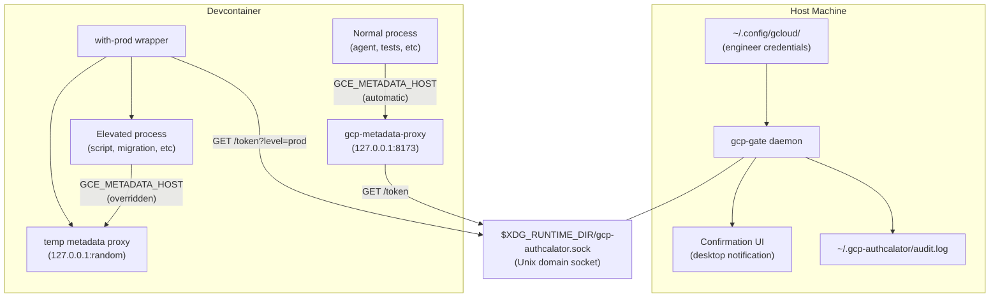

# Devcontainer Credential Isolation

gcp-authcalator is an auth escalator for GCP in development environments.

## Problem

Running an AI coding agent inside the same devcontainer as the engineer is convenient and encouraged by modern IDEs — but it creates a serious credential exposure problem. GCP credentials in the devcontainer are **global**: `google.auth.default()` returns the engineer's full-privilege credentials to any process. An unattended coding agent, a compromised dependency, or a prompt-injected tool has the same access as the engineer, including production database write access and SOPS secret decryption. There is no privilege boundary between the engineer's interactive session and automated tooling.

gcp-authcalator keeps credentials on the host and requires human approval for all privilege escalation. Processes running as other OS users cannot access the token socket (ideally, coding agents should run as a separate user). For same-user processes, defense-in-depth measures (PID-based restriction, environment isolation, rate limiting) make credential abuse significantly harder.

## Architecture


```mermaid
graph TB
  subgraph host [Host Machine]
    creds["~/.config/gcloud/\n(engineer credentials)"]
    gate["gcp-gate daemon\n"]
    confirm["Confirmation UI\n(desktop notification)"]
    audit["~/.gcp-authcalator/audit.log"]
    creds --> gate
    gate --> confirm
    gate --> audit
  end

  subgraph container [Devcontainer]
    proxy["gcp-metadata-proxy\n(127.0.0.1:8173)"]
    withprod["with-prod wrapper"]
    tmpproxy["temp metadata proxy\n(127.0.0.1:random)"]
    app["Normal process\n(agent, tests, etc)"]
    elevated["Elevated process\n(script, migration, etc)"]

    app -->|"GCE_METADATA_HOST\n(automatic)"| proxy
    elevated -->|"GCE_METADATA_HOST\n(overridden)"| tmpproxy
    withprod --> tmpproxy
    withprod --> elevated
  end

  socket["$XDG_RUNTIME_DIR/gcp-authcalator.sock\n(Unix domain socket)"]
  gate --- socket
  proxy -->|"GET /token"| socket
  withprod -->|"GET /token?level=prod"| socket
```

**Key security property:** Credentials never enter Docker. The Unix socket (local) or TCP+mTLS connection (remote) is the only channel, and the host daemon controls what tokens are issued.
The container only gets downscoped credentials that are only valid for a certain TTL, not the user's root credentials (which would be dangerous if intercepted or exfiltrated).

### Remote Architecture (TCP + mTLS)

For remote development environments (SSH devcontainers, GitHub Codespaces, Coder), the gate daemon also listens on a TCP port secured with mutual TLS. Unix sockets cannot cross network boundaries, so TCP+mTLS provides a secure transport for remote scenarios while preserving the core security property: credentials never leave the developer's machine.

```
Developer's Laptop                          Remote Host / Codespace / Coder
┌─────────────────────┐                     ┌──────────────────────────────┐
│  ADC credentials    │                     │  Devcontainer                │
│  gcp-gate daemon    │◄── mTLS over ───────│  gcp-metadata-proxy          │
│    TCP :8174        │    forwarded port    │    (127.0.0.1:8173)          │
│  Confirmation UI    │                     │  with-prod                   │
│  CA + server cert   │                     │  CA cert + client cert/key   │
└─────────────────────┘                     └──────────────────────────────┘
         │                                           │
    SSH port forward                          Port forwarding via:
    gh cs ports forward                        - SSH -R
    coder port-forward                         - VS Code
    VS Code port forward                       - gh CLI
                                               - Coder CLI
```

**Why mTLS (not bearer tokens)?**

- **Mutual authentication**: both sides verify identity (gate verifies client, client verifies gate)
- **No shared secret in transit**: TLS handshake, not a header token that could be logged
- **Certificate pinning**: the self-signed CA means no trust-store dependency
- **Replay resistance**: TLS session keys are ephemeral

**Certificate management:**

- Certificates are generated explicitly via `gcp-authcalator init-tls` (never auto-generated by gate)
- Gate loads and validates existing certs on startup; fails with a clear error if certs are missing or expired
- Server cert (SAN: localhost, 127.0.0.1) and client cert signed by the CA
- ECDSA P-256 algorithm (universally supported in WebCrypto)
- 90-day lifetime for all certificates (CA, server, and client)
- Client bundle (CA cert + client cert + client key) distributed as base64-encoded env var

**Local devcontainers remain unchanged** — Unix socket mode is the default and requires no TLS configuration.

## Design Decisions

### 1. Why a GCE metadata server emulator (not credential files)?

All Google Cloud client libraries -- Python `google-auth`, `gcloud` CLI, Node `google-auth-library` -- follow the same credential chain. The last step is the GCE metadata server. By setting `GCE_METADATA_HOST=127.0.0.1:8173`, all libraries transparently fetch tokens from our controlled proxy. **Zero application code changes needed.** This is the same mechanism GKE workloads already use.

### 2. Why a Unix domain socket (not bridge network/source port)?

The user's initial idea of tying privileges to a source port on a bridge network has issues:

- Source ports are **ephemeral** and not deterministically tied to processes
- A process inside the container could bind a specific port to impersonate an elevated process
- Docker bridge networks don't offer source-port-based access control

A Unix domain socket is a secure, private IPC channel. The host daemon controls it, and the container can only send requests through it -- it cannot access the credentials backing the daemon.

The end user will need to mount it into the devcontainer.

### 3. Why `generateAccessToken` (not Workload Identity Federation)?

GCP's IAM `generateAccessToken` API creates short-lived access tokens for a service account. The host daemon uses the engineer's credentials + `serviceAccountTokenCreator` role on the target service account to mint tokens. This avoids the complexity of setting up a WIF pool + custom OIDC issuer, while producing the same result: scoped, short-lived tokens.

WIF is a natural "Phase 2" enhancement if stronger audit trails or attribute conditions are needed.

### 4. Why per-process metadata proxy for elevation (not just env vars)?

`CLOUDSDK_AUTH_ACCESS_TOKEN` works for gcloud CLI, but Python `google-auth` and other libraries don't honor it. They need either a credential file or a metadata server. For `with-prod`, we spin up a **temporary metadata proxy on a random port** that serves the elevated token, and set `GCE_METADATA_HOST` for just that process tree. This makes elevation transparent to all libraries.

### 5. Why an operator socket (instead of per-request peer-credential checks)?

The naive solution to "auto-approve only when the human initiates" is `SO_PEERCRED` on a single shared socket. We chose to attach trust to the _socket itself_ via filesystem permissions. Reasons:

- **`Bun.serve({ unix })` does not expose connection-level peer credentials.** Implementing per-connection UID extraction would require dropping into raw `Bun.listen()` or `node:http`, doubling the maintenance surface for a feature whose security guarantee is already met by filesystem permissions.
- **Defense-in-depth is filesystem permissions either way.** Even with `SO_PEERCRED`, you'd still want the agent UID _unable to connect_ to the privileged path — otherwise it can probe the socket, burn rate-limit quota, or trigger confirmation-dialog spam to fatigue the operator. With perms-as-trust-boundary, this is automatic.
- **A single socket would also need to be `0666` or group-readable** so multiple UIDs can connect, opening the surface. A separate operator socket keeps the agent UID `EACCES`-fenced from the operator path.
- **Sessions are explicitly disabled on the operator socket** to remove the 8-hour bearer-token attack surface. With auto-approve firing per request, the only stealable artifact is the per-request access token, which already has the same lifetime as any other GCP token. The operator's `with-prod` falls back to per-request token mode automatically — vanilla GCP SDKs in the container never used sessions in the first place.
- **Out-of-allowlist requests on the operator socket return 403, not a confirmation prompt.** Falling through to a prompt encourages the operator to dismiss prompts reflexively, which is the failure mode this whole feature is trying to avoid. A request for a non-allowlisted policy belongs on the main socket.

**Two access modes** for the operator socket, selected by config:

| Mode                                    | Socket mode | Owner            | Trust boundary                                 | When to use                                                         |
| --------------------------------------- | ----------- | ---------------- | ---------------------------------------------- | ------------------------------------------------------------------- |
| **UID** (paved path; group unset)       | `0600`      | `gate_uid`       | Only `gate_uid` can connect (kernel-enforced)  | Single-operator deployments where the operator and gate share a UID |
| **Group** (`operator_socket_group` set) | `0660`      | `gate_uid:opgid` | Members of `operator_socket_group` can connect | Multi-operator deployments (shared workstation)                     |

UID mode is the paved default. It aligns with how local devcontainers are typically set up — UIDs match across host and container so bind-mounted source files have correct ownership — and it removes the need to create and manage a dedicated Unix group.

Group mode is retained for deployments where multiple humans share one gate. In group mode, the gate additionally refuses to start if the agent UID is a member of the operator group (a guardrail beyond what the kernel enforces).

The shared rate limiter is intentional: a flooding agent surfaces as a real rate-limit signal to the operator. A separate limiter on the operator socket would double the worst-case denial budget for marginal benefit. The operator can be starved by an agent flood, but the agent already has access to that bucket via the main socket — the attacker UID gains nothing new by spamming.

The single residual threat the operator socket cannot mitigate is **confused deputy via the operator's own UID**: anything that runs as the operator UID _is_ the operator from the gate's view (a malicious npm postinstall, an agent-suggested shell command, a planted shell rc, a tampered Makefile). The `auto_approve_pam_policies` allowlist caps the blast radius to a small set of pre-blessed entitlements — which is why the docs require treating that list with the same review rigor as IAM policy changes.

## Components

All components are sub-commands of a single `gcp-authcalator` binary, distributed as a compiled Bun executable.
Configuration (project ID, service account, socket path, port) can be provided via CLI flags or a TOML config file (CLI takes precedence).

### 1. GCP IAM Setup (prerequisites)

- Create a service account with limited permissions for development use.
- Grant developers the `roles/iam.serviceAccountTokenCreator` role on that service account.

### 2. `gcp-gate` -- Host-Side Token Daemon

A small HTTP server using the `google-auth-library` library. Runs on the host machine. Listens on a Unix domain socket and optionally on a TCP port with mutual TLS for remote devcontainer support.

**API (over Unix socket or TCP+mTLS):**

| Endpoint                | Behavior                                                                 |
| ----------------------- | ------------------------------------------------------------------------ |
| `GET /token`            | Impersonates the default SA, returns access token immediately            |
| `GET /token?level=prod` | Shows host-side confirmation, then returns token + engineer email        |
| `GET /identity`         | Returns the authenticated user's email                                   |
| `GET /project-number`   | Returns the numeric project ID (resolved via Cloud Resource Manager API) |
| `GET /universe-domain`  | Returns the GCP universe domain (resolved via GoogleAuth)                |
| `POST /session`         | Create a prod session (confirmation + PAM), returns session ID + token   |
| `GET /session?id=..`    | Validate a prod session without token minting or PAM work                |
| `DELETE /session?id=..` | Revoke a prod session                                                    |
| `GET /token?session=..` | Refresh token within a pre-approved session (no confirmation)            |
| `GET /health`           | Health check                                                             |

**Admin socket API** (separate Unix socket, not mounted into containers):

| Endpoint                    | Behavior                                          |
| --------------------------- | ------------------------------------------------- |
| `GET /pending`              | List pending requests, each with its full command |
| `GET /pending/:id`          | One pending request by ID, with its full command  |
| `POST /pending/:id/approve` | Approve a pending request by ID                   |
| `POST /pending/:id/deny`    | Deny a pending request by ID                      |
| `GET /health`               | Health check                                      |

Both token endpoints accept an optional `scopes` query parameter (comma-separated) to request tokens with specific OAuth scopes (e.g., `GET /token?scopes=https://www.googleapis.com/auth/sqlservice.login`). Defaults to `cloud-platform`.

**Request headers** consumed by the prod-path endpoints (`POST /session`, `GET /token?level=prod`, `GET /token?session=...`):

| Header              | Purpose                                                                                                                                                                                                                                                                                                                                                                                  |
| ------------------- | ---------------------------------------------------------------------------------------------------------------------------------------------------------------------------------------------------------------------------------------------------------------------------------------------------------------------------------------------------------------------------------------- |
| `X-Wrapped-Command` | JSON-array of the command being wrapped; surfaced **in full** in the confirmation dialog, and in the audit log as both an 80-char `command` summary and the complete `command_argv`. Redacted per argument before display. Bounded by the HTTP server's header limit; display caps (512 args / 2000 chars per arg / 32 KiB total) each announce themselves rather than eliding silently. |
| `X-Pending-Id`      | 32-hex client-generated ID for the CLI approval fallback (`gcp-authcalator approve <id>`). Rejected on the operator socket's auto-approve path.                                                                                                                                                                                                                                          |
| `X-Target-Project`  | Caller-supplied GCP project this request is targeting (sent by `with-prod --project=...`). Audit-only: echoed into the audit entry's `target_project` field, never validated against an allowlist. Empty values are ignored.                                                                                                                                                             |

**PAM entitlement scoping.** `pam_policy` accepts four forms: a short ID (expanded against the gate's `project_id` + `pam_location`), a full project-scoped path (`projects/{project}/locations/{loc}/entitlements/{id}` — must match `project_id`), a full folder-scoped path (`folders/{folder}/locations/{loc}/entitlements/{id}`), or a full organization-scoped path (`organizations/{org}/locations/{loc}/entitlements/{id}`). Folder- and org-scoped paths are accepted verbatim; the `project_id` config field plays no role in their resolution. These are the multi-project setup: one PAM grant covers every project beneath the folder or org, and `with-prod --project=...` selects which project a given invocation acts against without changing the entitlement.

**Token generation** uses `[iamcredentials.generateAccessToken](https://cloud.google.com/iam/docs/reference/credentials/rest/v1/projects.serviceAccounts/generateAccessToken)` for dev tokens (1-hour TTL). For prod tokens, it uses the engineer's own ADC (which stays on the host).

**Confirmation flow** for prod tokens:

1. Desktop dialog via `zenity` (Linux) or `osascript` (macOS) with approve/deny (60-second timeout)
2. Fallback: terminal prompt on the host (if TTY is available)
3. Fallback: pending approval queue for CLI-based approval via `gcp-authcalator approve` (120-second timeout)
4. Deny by default if no interactive method is available and the request times out

**Command disclosure.** A truncated command is an unreviewable one — the tail is
exactly where a hostile caller would put `--command=curl … | sh`. So when
`X-Wrapped-Command` is present, every surface renders the full redacted argv,
one numbered line per element, and each surface requires a deliberate act before
approval rather than a reflexive one:

| Surface        | Rendering                                                                             | Deliberate act                                                                                      |
| -------------- | ------------------------------------------------------------------------------------- | --------------------------------------------------------------------------------------------------- |
| Linux GUI      | `zenity --text-info`, body piped on **stdin** (never argv or a temp file), scrollable | `--checkbox="I have read the full command"` gates Allow                                             |
| macOS GUI      | `choose from list`, argv as list rows, script piped on **stdin** (`osascript -`)      | `default items {}` + omitted `empty selection allowed` keep Allow disabled until a line is selected |
| Terminal       | Every line printed to stdout; scrollback is the scroll affordance                     | Must type `yes`, not `y` (re-prompts once before denying)                                           |
| CLI (headless) | `gcp-authcalator pending [id]`; `approve` prints the command before resolving         | Types `yes`, or passes `--yes` off-TTY                                                              |

Neither GUI path can be truncated by the caller, and `describeCommand`
(`src/gate/summarize-command.ts`) strips control characters **per element**, so
an embedded newline cannot forge an extra numbered line in the list. Both GUI
paths feed the dialog over stdin rather than argv, so the command is not
readable from the host process table while the dialog is open.

A parent-side deadline (65 s) bounds the whole interaction — armed before the
stdin write, so a child that never drains stdin cannot wedge the flush itself.
This matters most for `choose from list`, which AppleScript gives no timeout of
its own; a wedged dialog would hold the rate limiter's single-flight lock
indefinitely. A GUI binary that _rejects_ our options (detected on stderr) is
treated as unavailable rather than as a denial, so an older zenity falls
through to the terminal prompt and pending queue instead of silently denying
every prod request on that host.

**Header bound.** `X-Wrapped-Command` is encoded by `encodeCommandHeader` under
a byte budget (`MAX_COMMAND_HEADER_BYTES`) chosen to sit well below the HTTP
server's header limit. Above that limit an oversized header is either rejected
with 431 or — worse, and measured on Bun's client — silently omitted, which
would present the operator with an unlabelled prod-grant dialog. When the
budget trims the argv, a marker element states how many arguments were dropped,
so the operator sees a claim about what is missing rather than a shorter
command.

**Rate limiting:** Single-flight lock (one dialog at a time), 1-second cooldown after denial, maximum 20 attempts per minute. This prevents automated brute-forcing of the confirmation flow. The lock protects the consent decision only: it is released immediately after approval or denial, before PAM and OAuth work. PAM acquisition and token minting run concurrently after approval, and a slow rotation therefore neither serially adds the minting latency nor prevents another caller from opening its confirmation dialog.

**PAM grant lifecycle and the drain margin:** When a `pam_policy` is in scope, PAM grant acquisition and prod-token minting start concurrently after approval; the gate caches the grant per entitlement and returns the token only after both operations succeed. Minted prod tokens are clamped to `grant_expiry - DRAIN_MARGIN_MS` (5 minutes), not to `grant_expiry`: PAM enforces "one open Grant per (entitlement, requester)" so rotation has no overlap window, and clamping the token short of the grant's actual end keeps concurrent clients from holding still-valid tokens when the rotation withdraws the old grant. The cache fast-path rotates at that same 5-minute boundary. Moving rotation earlier would withdraw authorization while a previously minted token could still be within its advertised lifetime; instead, adaptive client caching gives short remaining tokens a proportional refresh margin. Grant expiry is anchored to `auditTrail.accessGrantTime` (or the activated timeline event) plus `requestedDuration`; `createTime` is a conservative fallback, and a fresh response that omits usable timestamps gets an estimate anchored at request start using the full configured duration. This matters when approval is delayed: the access lifetime begins when PAM actually grants access, not when the request was created. Existing grants whose expiry cannot be bounded, or which PAM marks `externallyModified`, are never reused. Rotation is single-flight per entitlement (in-process), so multiple simultaneous token requests coalesce onto one withdraw + create cycle. Each attempt owns a generation; a replacement aborts the previous owner, and ownership is rechecked before cache changes and cleanup withdrawals so abandoned work cannot mutate the replacement's state. `grants.create` carries a nonzero UUID `requestId`; one ambiguous network, body-timeout, 429, or 5xx failure is retried with the same ID, while a conflict-recovery create gets a new ID. The gate ends its own grants with `grants:withdraw` (v1beta — the only surface that ships it), not `grants:revoke`: withdraw is the requester's own operation and works on any non-terminal grant, while revoke requires the approver/admin-level `privilegedaccessmanager.grants.revoke` permission that engineers don't hold. A grant name is marked locally as retiring immediately before the withdraw POST so a replacement scan cannot adopt access that is already being removed. `grants.withdraw` returns a long-running Operation and the gate polls it to `done:true` (best-effort, 30-s deadline) before retrying create, eliminating the race where PAM would still see the old grant as open. When create conflicts with an existing open grant, the recovery scan considers only grants whose `requester` matches the gate's authenticated identity — `grants.list` returns every team member's grants on a shared entitlement, and only the gate's own grants may be reused or withdrawn. Both active-but-expired grants (PAM's state lags actual expiry) and still-pending grants (e.g. `APPROVAL_AWAITED` left behind by an interrupted run) are treated as withdrawable blockers, and a freshly created grant that fails to activate within the polling deadline is withdrawn rather than left holding the open-grant slot. **Every PAM API call carries a per-request timeout (`PAM_FETCH_TIMEOUT_MS`), and a whole rotation is bounded by an overall wall-clock budget (`ROTATION_BUDGET_MS`).** Without these, a half-open connection or a PAM backend stalled behind IAM-replication lag would wait on the OS TCP timeout (minutes); and because rotation is single-flight per entitlement, one wedged call would block every concurrent and subsequent prod-token request for that entitlement. The budget aborts its PAM fetches, fences abandoned work from newer rotation state, and frees the single-flight slot. Shutdown is one-way: it rejects new rotations, aborts current owners, tracks grants discovered by late create responses, and spends at most 10 seconds dispatching withdrawals for grant names whose ownership was established. See `src/gate/pam.ts` for the full API-quirks table.

**PAM grant duration is configured independently of the token TTL.** `pam_grant_ttl_seconds` (CLI: `--pam-grant-ttl-seconds`; env: `GCP_AUTHCALATOR_PAM_GRANT_TTL_SECONDS`; range 301–43200 s — it must exceed `DRAIN_MARGIN_MS`; rejected at config-parse time) controls the lifetime requested when creating a PAM grant; `token_ttl_seconds` controls the lifetime of minted access tokens. When `pam_grant_ttl_seconds` is unset it falls back to `token_ttl_seconds` (the historical coupling) — and in that case, when `pam_policy` is set, `token_ttl_seconds` itself must clear the same margin (validated at config-parse time), since it is then the effective grant lifetime. Setting the grant longer than the token TTL — e.g. a 4-hour grant covering several 1-hour token refreshes — amortises PAM/IAM propagation latency across multiple refreshes: only the first request in a grant's lifetime pays the create + propagation cost, and subsequent token requests are served from the cached grant. The grant-expiry clamp (minus the 5-minute drain margin) still bounds every individual token, so a longer grant does not increase the lifetime of any token in flight; it only reduces how often the gate creates and withdraws grants.

**Error responses** are JSON `{ "error": "...", "code"?: "..." }`. The optional `code` field is reserved for conditions clients want to handle programmatically. Currently defined codes:

| Code                                       | HTTP | Meaning                                                                                                                                                                                                                                                                                                                                                                                                                                                                       |
| ------------------------------------------ | ---- | ----------------------------------------------------------------------------------------------------------------------------------------------------------------------------------------------------------------------------------------------------------------------------------------------------------------------------------------------------------------------------------------------------------------------------------------------------------------------------- |
| `credentials_expired`                      | 500  | The gate's gcloud Application Default Credentials need re-authentication. The `error` field contains the action-oriented recovery instruction, including the gate machine's hostname (from `os.hostname()`) so engineers in remote dev environments know which physical machine to run `gcloud auth application-default login` on. The gate clears its cached source client on this error so the next request after re-authentication succeeds without restarting the daemon. |
| `session_not_permitted_on_operator_socket` | 403  | Sessions are disabled on the operator socket. `with-prod` falls back to per-request token mode automatically.                                                                                                                                                                                                                                                                                                                                                                 |

**Deadline composition:** Bun's server-level idle timeout is disabled for gate
and metadata requests because healthy confirmation + PAM flows can exceed its
10-second default (and Bun's 255-second configured maximum). Application-level
deadlines provide the actual bounds: GoogleAuth discovery/token work is capped
at 30 seconds per operation; each PAM HTTP exchange, including its response
body, at 10 seconds; and a complete PAM rotation at 420 seconds. Client
backstops sit outside those server budgets: 720 seconds for initial prod
acquisition, 510 seconds for session refresh, route-specific 45–105 second
metadata proxy→gate calls, 5 seconds for admin-socket operations, and a 3-second
`with-prod` reachability preflight. This ordering lets legitimate inner work
finish while ensuring a half-open connection, stalled response body, or wedged
credential provider cannot fall through to an operating-system TCP timeout.

**Socket security:** The main Unix socket is created with `0660` permissions in a `0750` directory; the privileged operator socket (when configured) is `0600` in the same directory. The gate UID's primary group owns the directory and main socket — on UPG distros this is effectively `0600` end-to-end, but the gate UID's primary group can be deliberately extended (e.g. add a `the-robot` user) to grant a different-UID agent access to the main socket while still kernel-blocking it from the operator socket. The `$XDG_RUNTIME_DIR` directory itself is left at the system-managed `0700` per the XDG spec — group access to the main socket therefore requires placing `socket_path` in a gate-managed directory like `~/.gcp-authcalator/`. Config parsing rejects lexical path collisions; startup creates the parent directories, resolves each real parent, and rejects aliases through symlinked ancestors before any listener can unlink another listener's path. Stale sockets are cleaned up only after verifying ownership, refusing to follow symlinks, and checking that no other instance is running. Listener startup is transactional: if TLS validation, admin binding, or operator-socket validation fails after the main listener binds, every listener and socket created by that attempt is rolled back before the error is returned.

`with-prod` resolves its per-invocation sandbox parent directory **separately** from the gate's runtime dir (`$XDG_RUNTIME_DIR` → `$XDG_CACHE_HOME/gcp-authcalator` → `~/.cache/gcp-authcalator`). This decouples the caller-owned sandbox (where ephemeral gcloud config and token files live, `0600` owned by the calling UID) from the gate-owned config/socket dir (which may be shared between users via group perms or a symlink).

**Lifecycle:** Started by the devcontainer initialize script (runs on host before container build). Stopped when container is destroyed. Could later be a systemd/launchd user service for persistence.

### 3. `gcp-metadata-proxy` -- Container-Side Metadata Emulator

A minimal HTTP server implementing the GCE metadata server protocol (using data from the gcp-gate):

```
GET /computeMetadata/v1/instance
  → directory listing ("service-accounts/") — minimal stub that lets
    `gcp-metadata isAvailable()` (used by google-auth-library and
    firebase-admin) detect the proxy as a GCE-style metadata server

GET /computeMetadata/v1/instance/service-accounts/default/token
  → {"access_token": "ya29...", "expires_in": 3600, "token_type": "Bearer"}

GET /computeMetadata/v1/project/project-id
  → project id

GET /computeMetadata/v1/project/numeric-project-id
  → numeric project id (resolved via Cloud Resource Manager API)

GET /computeMetadata/v1/instance/service-accounts/
  → directory listing of available service accounts (returns "default")

GET /computeMetadata/v1/instance/service-accounts/default/scopes
  → newline-delimited OAuth scopes (configurable via scopes setting)

GET /computeMetadata/v1/universe/universe_domain
  → universe domain (e.g. "googleapis.com", resolved via gcp-gate)

GET /  (metadata server detection ping)
  → 200 OK with Metadata-Flavor: Google header

GET /session-health  (nested with-prod authority validation)
  → validates the backing gate session without minting a token or touching PAM

GET /identity  (authenticated user identity, proxied from gcp-gate)
  → {"email": "engineer@example.com"}
    Non-GCE endpoint (the standard .../default/identity path is reserved for
    OIDC identity tokens). Lets container-side tooling — e.g. telemetry that
    must attribute activity to a real person — discover the human behind the
    downscoped service account. Returns the engineer's real email (PII), so it
    requires the Metadata-Flavor: Google header like the data endpoints; 404
    when the proxy is backed by a custom token provider instead of a gate
    client.
```

Validates the `Metadata-Flavor: Google` request header (standard metadata server security) on all `/computeMetadata/` paths, `/identity` (which returns PII), and the private `/session-health` control route; only the non-sensitive detection ping (`/`) is exempt, matching real metadata-server behavior for the root ping. The exact service-account segment `default` and email-shaped identifiers route to the single credential source; other identifiers, including `default-*` lookalikes, return 404. Fetches dev-scoped tokens from `gcp-gate` via the socket and caches them until an adaptive refresh point: 10% of the observed lifetime, capped at 5 minutes before expiry.

**Started by** the devcontainer post start script as a background process.

### 4. `with-prod` -- Elevation Wrapper

The conceptual flow (simplified pseudocode):

```bash
#!/bin/bash
set -euo pipefail

# 1. Give the gate transport a 3-second health preflight, then create a prod
#    session at the host daemon (triggers confirmation dialog)
#    Returns a session ID + initial token. The session allows subsequent
#    token refreshes without re-confirmation for a bounded lifetime.
RESPONSE=$(curl -sf -X POST --unix-socket "$XDG_RUNTIME_DIR/gcp-authcalator.sock" \
  http://gate/session)

# 2. Start temporary metadata proxy with a session token provider that
#    auto-refreshes via GET /token?session=<id> when near expiry
#    (on a random port, restricted to the child process tree via PID validation)

# 3. Create an isolated gcloud config directory with the token written to a file
#    (not an env var — avoids /proc/*/environ exposure). File is atomically
#    updated on each token refresh.

# 4. Strip credential env vars and spawn the command with GCE_METADATA_HOST
#    pointing at the temporary proxy

# 5. Forward the first termination signal, allow 5 seconds for child cleanup,
#    then SIGKILL (a second signal kills immediately). Propagate the exit code,
#    revoke the session, and clean up temp files.
```

The actual implementation adds several security hardening measures beyond this pseudocode:

- **PID-based process restriction** — the temporary proxy validates that each requesting process is a descendant of the `with-prod` wrapper (via `/proc` introspection)
- **Token file instead of env var** — the access token is written to a `0600` file in a user-private directory, and gcloud is configured via `auth/access_token_file` rather than `CLOUDSDK_AUTH_ACCESS_TOKEN` (which leaks into `/proc/*/environ`). Refresh uses an unpredictable `O_EXCL` staging file plus atomic rename, and the in-memory cache commits only after that file update succeeds.
- **Environment stripping** — all credential-related env vars (`GOOGLE_APPLICATION_CREDENTIALS`, `CLOUDSDK_AUTH_ACCESS_TOKEN`, `CLOUDSDK_AUTH_CREDENTIAL_FILE_OVERRIDE`, etc.) are removed from the child's environment to prevent bypass
- **Temp directory in user-private runtime dir** — not `/tmp`, preventing other users from observing or racing the temp directory
- **Extra environment variables** — configurable via `[env]` TOML table or `--env` CLI flag. Values support `${VAR}` and `${VAR:-default}` substitution resolved after the elevated environment is built, allowing tools like GDAL to reference `GCE_METADATA_HOST` without tool-specific code in gcp-authcalator
- **Quota project** — sets `GOOGLE_CLOUD_QUOTA_PROJECT` so end-user-credential (prod) API calls have a quota/billing project. Defaults to the selected target project (the same value as `CLOUDSDK_CORE_PROJECT` / `GOOGLE_CLOUD_PROJECT`); `quota_project` pins a static project, and `no_quota_project` opts out (leaving any inherited value untouched, and taking precedence over `quota_project`). The value is set on the base environment before the `[env]` extras are applied, so an explicit `[env] GOOGLE_CLOUD_QUOTA_PROJECT` still wins
- **Non-mutating nested detection** — validates the parent proxy's exact gate session through `/session-health`, then checks its root, email, and project routes without calling `/token`; an expired or orphaned session falls back to normal acquisition, and a health check cannot trigger a long PAM refresh that it will abandon after its short probe deadline
- **Transactional setup and cleanup** — once a prod session exists, every later setup failure restores the process umask, stops any temporary proxy, removes token-bearing files, and awaits best-effort session revocation before exiting
- **Bounded signal handling** — before spawn, `SIGINT` or `SIGTERM` aborts the gate acquisition and exits with the conventional 130/143 status. After spawn, the first signal is forwarded to the wrapped child and escalates to `SIGKILL` after 5 seconds; a second signal escalates immediately. Handlers and pending escalation timers are removed when each phase ends.

Usage: `with-prod -- python some/script.py`, `with-prod -- gcloud sql instances list`, `with-prod -- alembic upgrade head`

### 5. `pending` / `approve` / `deny` -- CLI Approval of Pending Requests

When the gate's confirmation module cannot show a GUI dialog or terminal prompt (headless environments, containers without a display), prod access requests are queued as pending. These commands connect to the gate's admin socket and provide CLI-based approval:

- `gcp-authcalator pending [id]` — List queued requests, or show one, with the command in full
- `gcp-authcalator approve <id> [--yes]` — Approve a pending request by its 32-character hex ID (128 bits)
- `gcp-authcalator deny <id>` — Deny a pending request

`approve` fetches and prints the request's complete argument list before it POSTs the resolve, then requires the operator to type `yes`; off a TTY it exits non-zero unless `--yes` is given. The pending queue therefore stores the whole `CommandDisplay`, not just the 80-character summary — the summary alone would put the CLI path back in the position of approving what it cannot see.

The admin socket serves `GET /pending` and `GET /pending/:id` for this. Placing them there rather than on the main socket is deliberate: the socket is not mounted into devcontainers, so the process that requested prod access cannot read back what the operator is being shown.

The `with-prod` command generates and prints the pending ID before requesting a session, so you can review and approve it immediately. Pending requests auto-deny after 120 seconds (2x the GUI dialog timeout, to allow time for terminal switching). The gate logs request IDs and approval instructions to stderr when a request is queued.

All three commands connect to the gate's **admin socket** (separate from the main socket, not mounted into devcontainers). They do not require `--project-id` — only `--admin-socket-path` is needed (defaults to `$XDG_RUNTIME_DIR/gcp-authcalator-admin/admin.sock`).

### 6. `init-tls` -- TLS Certificate Management

Generates and manages TLS certificates for remote devcontainer support:

- `gcp-authcalator init-tls` — Force-regenerate all TLS certificates
- `gcp-authcalator init-tls --bundle-b64` — Print base64-encoded client bundle to stdout
- `gcp-authcalator init-tls --show-path` — Print TLS directory path

Certificates are stored in `~/.gcp-authcalator/tls/` by default, or the configured `tls_dir`, with private material and bundles at `0600` in a `0700` directory. This is intentionally different from the socket directory — certificates must survive reboots (90-day lifetime), while the Unix socket is ephemeral runtime state. Startup opens authoritative files without following symlinks and verifies ownership, modes, validity dates, CA BasicConstraints/keyCertSign, leaf EKU/identity/SAN constraints, signatures, and key/certificate matches. A server certificate lacking only the `host.docker.internal` SAN (generated before #72) is accepted with a warning rather than bricking a working gate on upgrade. A missing derived client bundle is reconstructed from a valid chain instead of rotating it; material that merely cannot be read safely (permissions drift, ownership change, symlink) surfaces as an error instead of triggering regeneration. Client bundles configured via `tls_bundle` are validated for content but read without symlink/ownership/mode checks — distributed bundles legitimately live on Kubernetes secret mounts and bind mounts. Writes use exclusive random staging files plus atomic rename.

### 7. Remote Transport Configuration

New config options and env vars for remote devcontainer support:

| Config option   | CLI flag          | Env var                          | Description                              |
| --------------- | ----------------- | -------------------------------- | ---------------------------------------- |
| `gate_tls_port` | `--gate-tls-port` | `GCP_AUTHCALATOR_GATE_TLS_PORT`  | Gate TCP+mTLS listener port              |
| `tls_dir`       | `--tls-dir`       | `GCP_AUTHCALATOR_TLS_DIR`        | TLS certificate directory                |
| `gate_url`      | `--gate-url`      | `GCP_AUTHCALATOR_GATE_URL`       | HTTPS gate base URL                      |
| `tls_bundle`    | `--tls-bundle`    | `GCP_AUTHCALATOR_TLS_BUNDLE`     | Path to TLS client bundle file           |
| —               | —                 | `GCP_AUTHCALATOR_TLS_BUNDLE_B64` | Base64-encoded client bundle (preferred) |

Config precedence: CLI args > env vars > TOML file > schema defaults. (Until v0.10 this was `env > CLI > TOML`, which inverted universal CLI convention; the swap matches expectations and removes the silent override of explicit `--flag` invocations by inherited env vars.)

`gate_url` must be an HTTPS URL: credentials, queries, fragments, and dot-segment paths are rejected along with plaintext `http://` URLs. A plain path is allowed (gates behind a path-routing reverse proxy). Trailing slashes are accepted and removed before endpoint paths are appended, preventing accidental `//token`-style request paths.

TOML configuration is strict: unknown keys are errors instead of being silently discarded. `scopes` must contain at least one scope. The main, admin, and optional operator socket paths are expanded, normalized absolute paths and must be pairwise distinct, preventing a later listener from unlinking or replacing a socket that this gate instance already bound.

`GCP_AUTHCALATOR_TLS_BUNDLE_B64` is handled specially: after reading, it is deleted from `process.env` to prevent inheritance by child processes.

### 8. Kubernetes exec credentials

`kube-setup` finds kubeconfig users backed by `gke-gcloud-auth-plugin`, writes a
mode-preserving `<kubeconfig>.bak`, and replaces their exec block with the
absolute `gcp-authcalator kube-token` command. Backup and target replacement
both use exclusive temporary files followed by atomic rename; a symlinked
kubeconfig updates its resolved target rather than replacing the symlink.
A kubeconfig the user can write but does not own (a shared root:group file), or
one whose directory is not writable, cannot be replaced by rename without
changing its ownership or failing outright — those setups keep the historical
in-place write. Failure to create the backup warns and continues, since the
patch is revertible with `gcloud container clusters get-credentials`.

`kube-token` fetches from the active metadata proxy and emits an
`ExecCredential`. It reads `KUBERNETES_EXEC_INFO` and mirrors a requested
`client.authentication.k8s.io/v1` or `v1beta1` API version, defaulting to
`v1beta1` when the variable is absent or unusable. The response advertises an
expiration about one second in the future so kubectl does not reuse a dev token
inside an unrelated `with-prod` process (or vice versa); token caching remains
inside the PID-restricted metadata proxy.
