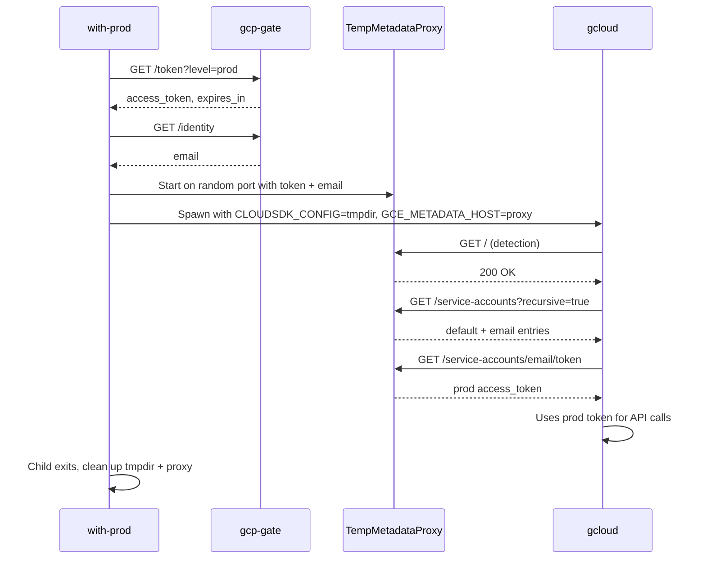

# Fix gcloud Credential Isolation in with-prod

## Root Cause

There are two issues preventing gcloud from using the prod credentials served by `with-prod`:

1. **gcloud token caching**: gcloud caches tokens and account state in `~/.config/gcloud/` (specifically `access_tokens.db` and properties files). Once gcloud has interacted with the main metadata proxy (port 8173) and cached the dev-scoped SA token, it reuses the cache in subprocesses even when `GCE_METADATA_HOST` points to the temp with-prod proxy.
2. **Missing service account email in temp proxy**: The temp proxy is created with `service_account: undefined` ([with-prod.ts line 67](src/commands/with-prod.ts)). This means the service account listing at `/computeMetadata/v1/instance/service-accounts` only returns `default/`. gcloud's `Metadata().Accounts()` filters out "default" and only recognizes email addresses, so gcloud won't discover **any** account from the temp proxy, even if it does query it fresh.

## Solution

### A. Isolate gcloud config with `CLOUDSDK_CONFIG`

In [src/commands/with-prod.ts](src/commands/with-prod.ts), create a temporary directory and set `CLOUDSDK_CONFIG` to it in the child process environment. This gives gcloud a clean slate -- no cached tokens, no pre-configured account. gcloud will discover everything fresh from the temp metadata proxy.

- Use `mkdtemp` from `node:fs` to create a temp dir (e.g., `/tmp/gcp-authcalator-gcloud-XXXXXX`)
- Set `CLOUDSDK_CONFIG` in the child env
- Clean up with `rm -rf` in the finally/cleanup path after the child exits

### B. Fetch engineer's email from gcp-gate

The temp proxy needs a real email address in the service account listing. Extend [src/with-prod/fetch-prod-token.ts](src/with-prod/fetch-prod-token.ts) to also fetch `GET /identity` from gcp-gate, returning the engineer's email alongside the token. The gate already exposes this at the `/identity` endpoint ([gate/handlers.ts line 182-189](src/gate/handlers.ts)).

```typescript
// fetch-prod-token.ts - add email to result
export interface ProdTokenResult {
  access_token: string;
  expires_in: number;
  email: string; // new field
}
```

### C. Pass email to temp metadata proxy

In [with-prod.ts](src/commands/with-prod.ts), pass `tokenResult.email` as the `service_account` when constructing the temp proxy config:

```typescript
const { server, stop } = startMetadataProxyServer(
  {
    project_id: wpConfig.project_id,
    service_account: tokenResult.email,  // was: undefined
    socket_path: wpConfig.socket_path,
    port: 0,
  },
  { ... },
);
```

This ensures gcloud discovers the account via `/computeMetadata/v1/instance/service-accounts` (which will now list both `default/` and `<email>/`).

## Files to Change

- **[src/with-prod/fetch-prod-token.ts](src/with-prod/fetch-prod-token.ts)** -- Add `/identity` fetch, return email in `ProdTokenResult`
- **[src/commands/with-prod.ts](src/commands/with-prod.ts)** -- Create temp `CLOUDSDK_CONFIG` dir, pass email to temp proxy, clean up on exit
- **[src/tests/commands/with-prod.test.ts](src/__tests__/commands/with-prod.test.ts)** -- Update mock fetch to handle both `/token` and `/identity` requests; verify `CLOUDSDK_CONFIG` is set to a temp dir and cleaned up; verify email is passed to proxy
- **[CHANGELOG.md](CHANGELOG.md)** -- Add entry under `[Unreleased]`

## Data Flow After Fix


