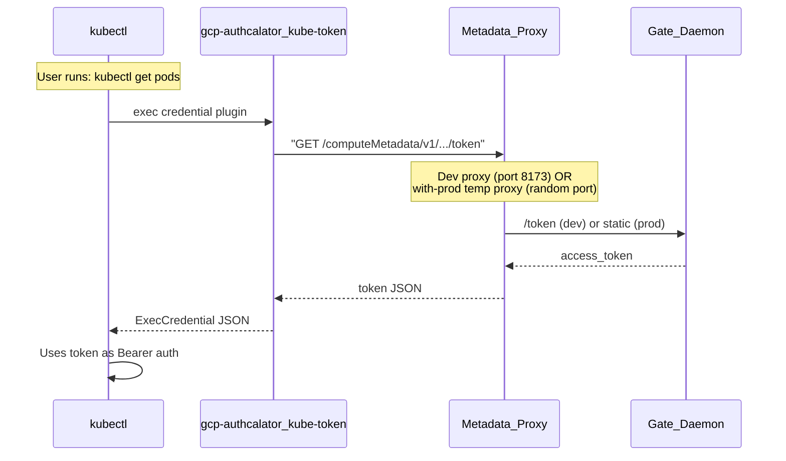

# kubectl Credential Plugin for gcp-authcalator

## Problem

`gke-gcloud-auth-plugin` caches tokens at a hardcoded path (`~/.kube/gke_gcloud_auth_plugin_cache`) and does NOT respect `CLOUDSDK_CONFIG` ([upstream issue #554](https://github.com/kubernetes/cloud-provider-gcp/issues/554), closed as "not planned"). When `with-prod` escalates privileges, the plugin continues serving the stale dev-tier cached token. The only workaround today is manually running `gcloud container clusters get-credentials` inside the with-prod shell.

## Solution

Replace `gke-gcloud-auth-plugin` with a purpose-built kubectl [exec credential plugin](https://kubernetes.io/docs/reference/access-authn-authz/authentication/#client-go-credential-plugins) that fetches tokens directly from whichever authcalator metadata proxy is active.

Two new CLI subcommands:

### 1. `kube-token` -- Credential plugin (kubectl calls this)

A new command at [src/commands/kube-token.ts](src/commands/kube-token.ts) that:

- Reads `GCE_METADATA_HOST` from the environment (falls back to config port)
- Makes a GET request to `http://$GCE_METADATA_HOST/computeMetadata/v1/instance/service-accounts/default/token` with the `Metadata-Flavor: Google` header
- Prints an `ExecCredential` JSON response to stdout:

```json
{
  "apiVersion": "client.authentication.k8s.io/v1beta1",
  "kind": "ExecCredential",
  "status": {
    "token": "<access_token>",
    "expirationTimestamp": "<RFC3339 timestamp>"
  }
}
```

**Cache strategy**: Set `expirationTimestamp` to ~1 second from now. This effectively disables kubectl's exec credential cache, forcing it to re-invoke the plugin on every API call. This prevents inconsistent auth when multiple kubectl processes run concurrently (e.g. one normal, one under `with-prod`). The metadata proxy and gate already cache tokens, so the plugin just does a fast localhost HTTP round-trip -- negligible overhead.

- Must write ONLY the ExecCredential JSON to stdout (no log output -- send diagnostics to stderr)
- No config file required -- `GCE_METADATA_HOST` is the only input
- Falls back to `127.0.0.1:8173` (the default metadata proxy port) if `GCE_METADATA_HOST` is not set

### 2. `kube-setup` -- Patches kubeconfig (one-time setup)

A new command at [src/commands/kube-setup.ts](src/commands/kube-setup.ts) that:

- Reads the kubeconfig (from `$KUBECONFIG` or `~/.kube/config`)
- Finds all users with `exec.command: gke-gcloud-auth-plugin`
- Replaces the exec section to point to `gcp-authcalator kube-token`
- Writes the patched kubeconfig back
- Prints a summary of what was changed

The patched kubeconfig user entry will look like:

```yaml
users:
  - name: gke_project_region_cluster
    user:
      exec:
        apiVersion: client.authentication.k8s.io/v1beta1
        command: gcp-authcalator
        args: ["kube-token"]
        installHint: "Install gcp-authcalator or revert with: gcloud container clusters get-credentials <cluster>"
        provideClusterInfo: true
```

The command should:

- Warn if no gke-gcloud-auth-plugin entries are found
- Users can revert by re-running `gcloud container clusters get-credentials` if needed

## Files Created/Modified

- **New**: [src/commands/kube-token.ts](src/commands/kube-token.ts) -- credential plugin command
- **New**: [src/commands/kube-setup.ts](src/commands/kube-setup.ts) -- kubeconfig patching command
- **New**: [src/**tests**/commands/kube-token.test.ts](src/__tests__/commands/kube-token.test.ts) -- tests for kube-token
- **New**: [src/**tests**/commands/kube-setup.test.ts](src/__tests__/commands/kube-setup.test.ts) -- tests for kube-setup
- **Modified**: [src/cli.ts](src/cli.ts) -- registered the two new subcommands
- **New dep**: `yaml` -- for kubeconfig YAML parsing/writing

## Data Flow



Under `with-prod`, `GCE_METADATA_HOST` points to the temporary prod metadata proxy, so `kube-token` automatically picks up the prod token. No cache invalidation needed.

## Key Design Decisions

- **~1 second `expirationTimestamp`**: kubectl's exec credential cache is keyed by the static kubeconfig exec spec and ignores process env vars like `GCE_METADATA_HOST`. By setting expiry to ~1s, we effectively disable the cache, ensuring concurrent kubectl processes (some under `with-prod`, some not) always get the correct token for their own metadata proxy. The overhead is one localhost HTTP round-trip per kubectl API call -- negligible since the metadata proxy caches tokens.
- **Minimal deps**: The `kube-token` command only needs `fetch` -- no gcloud, no google-auth-library.
- **kubeconfig format**: Uses the `yaml` library for kubeconfig manipulation in `kube-setup`.
