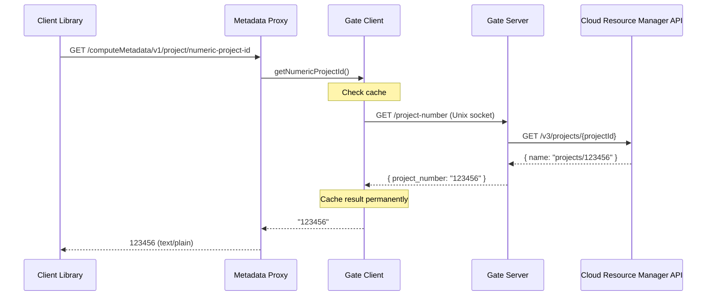

# Implement Numeric Project ID Endpoint

## Architecture

The numeric project ID (project number) must be looked up from the string project ID via the Cloud Resource Manager API. Following the existing architecture where all GCP API calls are centralized in the gate server:



## Gate Server Changes

### 1. `src/gate/auth.ts` -- Add `getProjectNumber()`

Add a new method to `AuthModule` that:

- Gets an access token from the source client (ADC)
- Calls `GET https://cloudresourcemanager.googleapis.com/v3/projects/{config.project_id}`
- Extracts numeric ID from the `name` field (`"projects/123456"` -> `"123456"`)
- Caches the result permanently (project numbers are immutable)
- Accepts `fetchFn` override for testing (existing pattern from `getIdentityEmail`)

```typescript
async function getProjectNumber(): Promise<string> {
  if (projectNumberCache) return projectNumberCache;
  const client = await getSourceClient();
  const { token } = await client.getAccessToken();
  const resp = await fetchFn(
    `https://cloudresourcemanager.googleapis.com/v3/projects/${encodeURIComponent(config.project_id)}`
    { headers: { Authorization: `Bearer ${token}` } },
  );
  // parse "projects/123456" from response.name
}
```

### 2. `src/gate/types.ts` -- Extend `GateDeps`

Add `getProjectNumber: () => Promise<string>` to the `GateDeps` interface.

### 3. `src/gate/handlers.ts` -- Add `/project-number` route

Add a new case in the switch statement:

```typescript
case "/project-number":
  return handleProjectNumber(deps);
```

Returns JSON: `{ "project_number": "123456789012" }`. Returns 500 on failure (same pattern as `/identity`).

### 4. `src/gate/server.ts` -- Wire the new dep

Add `getProjectNumber: auth.getProjectNumber` to the `deps` object. Add the endpoint to the startup log.

## Metadata Proxy Changes

### 5. `src/metadata-proxy/types.ts` -- Extend `MetadataProxyDeps`

Add optional `getNumericProjectId?: () => Promise<string>` to `MetadataProxyDeps`. Optional because `with-prod` creates a temporary proxy with a static token provider that may not have gate access.

### 6. `src/metadata-proxy/gate-client.ts` -- Add `getNumericProjectId`

Extend the returned object from `createGateClient` to include a `getNumericProjectId` method:

- Fetches `GET /project-number` from the gate daemon via Unix socket
- Caches the result permanently (immutable value)
- Returns the `project_number` string from the JSON response

Update the return type -- either extend `TokenProvider` or create a new `GateClient` interface that includes both `getToken` and `getNumericProjectId`.

### 7. `src/metadata-proxy/handlers.ts` -- Add numeric-project-id route

Add a new case in the switch:

```typescript
case "/computeMetadata/v1/project/numeric-project-id":
  return handleNumericProjectId(deps);
```

- If `deps.getNumericProjectId` is defined, call it and return the result as plain text
- If undefined (with-prod case), return 404
- On error, return 500 with error message

### 8. `src/metadata-proxy/server.ts` -- Wire the new dep

When creating `MetadataProxyDeps`, provide `getNumericProjectId` from the gate client. Update the startup log to include the new endpoint.

Also need to update `mockGateFetch` in server tests to be URL-aware (currently returns a token response for all requests).

## Test Changes

### 9. Gate tests

- [src/**tests**/gate/handlers.test.ts](src/__tests__/gate/handlers.test.ts): Add tests for `GET /project-number` (success, error)
- New or existing auth test: Test `getProjectNumber` with mock fetch (success, error, caching)

### 10. Metadata proxy tests

- [src/**tests**/metadata-proxy/handlers.test.ts](src/__tests__/metadata-proxy/handlers.test.ts): Add tests for `numeric-project-id` endpoint (success, 404 when not configured, 500 on error)
- [src/**tests**/metadata-proxy/gate-client.test.ts](src/__tests__/metadata-proxy/gate-client.test.ts): Add tests for `getNumericProjectId` (fetch, cache, error)
- [src/**tests**/metadata-proxy/server.test.ts](src/__tests__/metadata-proxy/server.test.ts): Add integration test for `numeric-project-id`, update `mockGateFetch` to be URL-aware

## Documentation

### 11. CHANGELOG.md

Add under `[Unreleased]`:

```
### Added
- `numeric-project-id` endpoint in metadata proxy (`/computeMetadata/v1/project/numeric-project-id`)
- `/project-number` endpoint in gate server for project number resolution
```

### 12. Plans and existing docs

- Update [plans/implement-gcp-metadata-proxy.md](plans/implement-gcp-metadata-proxy.md) endpoint table to include the new endpoint
- Update [GOAL.md](GOAL.md) metadata proxy endpoint listing

## No New Dependencies

The Cloud Resource Manager API call uses raw `fetch` with an authenticated token, following the same pattern as `getIdentityEmail` in [src/gate/auth.ts](src/gate/auth.ts). No new npm packages needed.
