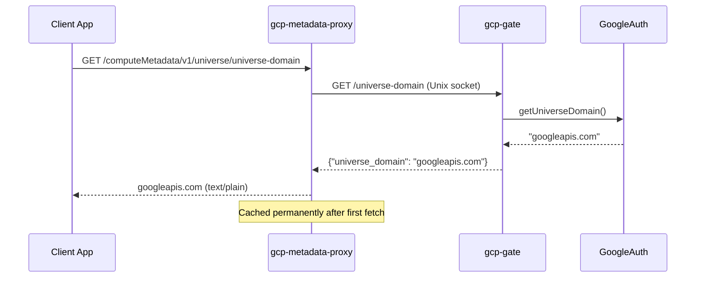

# Universe Domain Endpoint

## Background

The real GCE metadata server exposes `/computeMetadata/v1/universe/universe-domain`, returning the universe domain for the GCP environment (e.g., `googleapis.com` for standard Google Cloud, or a different value for sovereign clouds). Some Google Cloud client libraries query this endpoint during initialization.

## Design

Follow the same pattern as `numeric-project-id`:

- Gate daemon resolves the value using `google-auth-library` and exposes it via a new endpoint
- Gate client fetches and permanently caches it (immutable value)
- Metadata proxy handler serves it, returning 404 if no gate client is available (custom `tokenProvider` mode)



## Changes

### 1. Gate: auth module -- [src/gate/auth.ts](src/gate/auth.ts)

Add `getUniverseDomain()` to `AuthModule` interface and implementation. Use `GoogleAuth.getUniverseDomain()` from google-auth-library with permanent caching (same pattern as `getProjectNumber`):

```typescript
async function getUniverseDomain(): Promise<string> {
  if (universeDomainCache) return universeDomainCache;
  const auth = new GoogleAuth({ scopes: DEFAULT_SCOPES });
  universeDomainCache = await auth.getUniverseDomain();
  return universeDomainCache;
}
```

### 2. Gate: types -- [src/gate/types.ts](src/gate/types.ts)

- Add `UniverseDomainResponse` interface: `{ universe_domain: string }`
- Add `getUniverseDomain: () => Promise<string>` to `GateDeps`

### 3. Gate: handlers -- [src/gate/handlers.ts](src/gate/handlers.ts)

Add `/universe-domain` case to the switch statement and a `handleUniverseDomain` function (mirrors `handleProjectNumber`):

```typescript
case "/universe-domain":
  return handleUniverseDomain(deps);
```

### 4. Gate: server wiring -- [src/gate/server.ts](src/gate/server.ts)

Wire `auth.getUniverseDomain` into `GateDeps` and add the endpoint to startup logs.

### 5. Metadata proxy: types -- [src/metadata-proxy/types.ts](src/metadata-proxy/types.ts)

- Add `getUniverseDomain?: () => Promise<string>` to `MetadataProxyDeps`
- Add `getUniverseDomain: () => Promise<string>` to `GateClient`

### 6. Metadata proxy: gate-client -- [src/metadata-proxy/gate-client.ts](src/metadata-proxy/gate-client.ts)

Add `getUniverseDomain()` with permanent caching (identical pattern to `getNumericProjectId`):

```typescript
async function getUniverseDomain(): Promise<string> {
  if (universeDomainCache) return universeDomainCache;
  const res = await fetchFn("http://localhost/universe-domain", {
    unix: socketPath,
  } as RequestInit);
  // ... error handling ...
  universeDomainCache = body.universe_domain;
  return universeDomainCache;
}
```

### 7. Metadata proxy: handlers -- [src/metadata-proxy/handlers.ts](src/metadata-proxy/handlers.ts)

Add case to the switch in `handleRequest` and a `handleUniverseDomain` function (mirrors `handleNumericProjectId`):

```typescript
case "/computeMetadata/v1/universe/universe-domain":
  return handleUniverseDomain(deps);
```

Returns 404 if `deps.getUniverseDomain` is undefined (custom tokenProvider mode), 500 on fetch error, text/plain response on success.

### 8. Metadata proxy: server wiring -- [src/metadata-proxy/server.ts](src/metadata-proxy/server.ts)

Wire `gateClient?.getUniverseDomain` into deps and add the endpoint to startup log output.

### 9. Tests

- **[src/**tests**/metadata-proxy/handlers.test.ts](src/**tests**/metadata-proxy/handlers.test.ts)**: Add test block for `GET /computeMetadata/v1/universe/universe-domain` covering: success case, 404 when not configured, 500 on fetch failure
- **[src/**tests**/metadata-proxy/server.test.ts](src/**tests**/metadata-proxy/server.test.ts)**: Add integration test, update `mockGateFetch` to handle `/universe-domain` requests
- **[src/**tests**/gate/handlers.test.ts](src/**tests**/gate/handlers.test.ts)**: Add tests for the new `/universe-domain` gate endpoint
- **[src/**tests**/gate/auth.test.ts](src/**tests**/gate/auth.test.ts)**: Add tests for `getUniverseDomain` in the auth module

### 10. GOAL.md -- [GOAL.md](GOAL.md)

Add `GET /computeMetadata/v1/universe/universe-domain` to the metadata proxy endpoint listing in the Components section, and add `GET /universe-domain` to the gate endpoint table.
